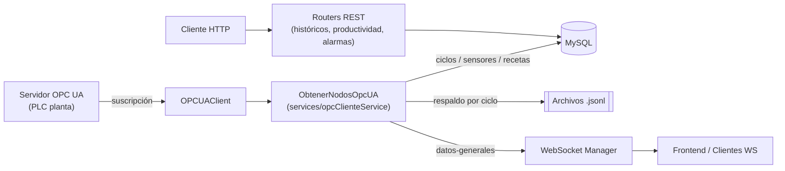

# Sistema de Adquisición de Datos — Cremona Inoxidable S.A.

API backend construida en **FastAPI** que se conecta a un **servidor OPC UA** para
capturar en tiempo real el estado de los equipos de planta (cocinas y
enfriadores), persistir la información de cada ciclo productivo en **MySQL**
y transmitirla a los clientes mediante **WebSockets**.

---

## Tabla de contenidos

- [Descripción general](#descripción-general)
- [Arquitectura](#arquitectura)
- [Estructura del proyecto](#estructura-del-proyecto)
- [Modelo de datos](#modelo-de-datos)
- [Endpoints](#endpoints)
- [Instalación y ejecución](#instalación-y-ejecución)
- [Despliegue con Docker](#despliegue-con-docker)

---

## Descripción general

El sistema navega el árbol de nodos de un servidor **OPC UA** (biblioteca
`opcua`), se suscribe a los valores de los equipos de dos líneas de
producción (`PF-L1` y `PF-L2`), cada una con sectores de **Cocina** y
**Enfriador**, y con esos datos:

- Detecta el **ciclo productivo** activo de cada equipo (inicio, pausas,
  fin) y lo persiste en la tabla `ciclo`.
- Registra la traza de **sensores analógicos** (temperatura de agua,
  ingreso, producto, nivel de agua) y **sensores digitales/IO** (bombas,
  válvulas, vapor) asociados a cada ciclo.
- Buffer intermedio en archivos **JSONL** (uno por ciclo) como resguardo
  ante caídas del proceso, con reconstrucción/recuperación automática al
  reiniciar.
- Sincroniza el **recetario** cargado en el PLC con la tabla `receta`.
- Publica el estado de todos los equipos por **WebSocket** cada 1 segundo
  para el frontend en tiempo real.
- Expone endpoints REST para **históricos** (gráficos por ciclo,
  productividad por equipo) con exportación a **Excel**.
- Administra **usuarios** con roles (`superadmin`, `admin`, `user`) y
  tablas de **alarmas** (nivel 1 y nivel 2) con su histórico.
- Monitorea la conexión OPC UA en segundo plano y se **reconecta
  automáticamente** ante caídas, sin interrumpir el resto de la API.

## Arquitectura



Componentes clave:

| Componente | Responsabilidad |
|---|---|
| `config/opc.py` | Cliente OPC UA: conexión, reconexión, suscripción a nodos, cache en memoria (`OPCUASubscriptionHandler`) y *health check* (`ping`). |
| `services/opcClienteService.py` | Lógica de negocio principal: navegación del árbol OPC, resolución de ciclos, trazabilidad de sensores IO/analógicos, recetario, buffer JSONL y cierre/persistencia de ciclos. |
| `config/ws.py` | Gestor de conexiones WebSocket y broadcast de mensajes. |
| `config/db.py` | Engine y sesión de SQLAlchemy sobre MySQL, con monitor de reconexión propio. |
| `models/*.py` | Modelos ORM (SQLAlchemy) de las tablas de negocio. |
| `routers/*.py` | Endpoints REST agrupados por dominio (históricos, productividad, alarmas). |
| `main.py` | Arranque de FastAPI, *lifespan* (carga de datos semilla, tareas de fondo), definición del WebSocket principal y health check. |

## Estructura del proyecto

```
.
├── main.py                     # Punto de entrada FastAPI
├── config/
│   ├── db.py                   # Conexión MySQL / SQLAlchemy
│   ├── opc.py                  # Cliente OPC UA
│   └── ws.py                   # Manejador de WebSockets
├── models/
│   ├── ciclo.py
│   ├── equipo.py
│   ├── estadoCiclo.py
│   ├── receta.py
│   ├── sensores.py
│   ├── sensoresAA.py           # Sensores analógicos
│   ├── sensoresIO.py           # Sensores digitales (entradas/salidas)
│   ├── alarmas.py              # Alarmas L1
│   ├── alarmasL2.py            # Alarmas L2
│   ├── historicoAlarma.py
│   └── usuarios.py
├── services/
│   ├── opcClienteService.py    # Lógica principal de adquisición
│   └── historicoServices.py    # Generación de reportes/xlsx (referenciado)
├── routers/
│   ├── historicoGraficos.py
│   ├── historicoProductividad.py
│   └── historicoAlarmas.py     
├── data/
│   ├── bdd/                    # Scripts .sql de carga inicial
│   └── opc_historial/          # Buffer JSONL por equipo/ciclo (configurable)
├── docker-compose.yml
└── .env
```

## Modelo de datos

- **`equipo`** ⇄ **`ciclo`**: cada ciclo pertenece a un equipo.
- **`ciclo`** ⇄ **`receta`**: cada ciclo referencia la receta utilizada.
- **`ciclo`** ⇄ **`estadociclo`**: tramos de estado (PRE OPERACIONAL,
  OPERACIONAL, PAUSADO, etc.) con su duración.
- **`sensoresaa`**: muestras de sensores analógicos (temperatura, nivel)
  asociadas a un ciclo, filtradas/submuestreadas al cierre del ciclo.
- **`sensoresio`**: tramos de sensores booleanos (bombas, válvulas, vapor)
  con fecha de inicio/fin, asociados a un ciclo.
- **`alarmas`** / **`alarmas_l2`**: catálogo de alarmas por nivel.
- **`historico_alarma`**: registro histórico de activación/desactivación
  de alarmas.
- **`Usuarios`**: usuarios de la aplicación con rol y estado.

Los estados de equipo reconocidos son:

| Código | Estado |
|---|---|
| 1 | PRE OPERACIONAL |
| 2 | OPERACIONAL |
| 3 | PAUSADO |
| 4 | INACTIVO |
| 5 | CANCELADO |
| 6 | FINALIZADO |
| 7 | LIMPIEZA |

`PRE OPERACIONAL`, `OPERACIONAL` y `PAUSADO` mantienen el ciclo abierto y en
captura continua; `FINALIZADO` y `CANCELADO` disparan el cierre del ciclo
(persistencia final en BD y archivado del JSONL).

## Endpoints

| Método | Ruta | Descripción |
|---|---|---|
| `GET` | `/` | Health check (estado de BD y OPC UA). |
| `WS` | `/ws/{id}` | Canal WebSocket genérico de eco/keep-alive. |
| `WS` | `datos-generales` (broadcast interno) | Estado en tiempo real de cocinas y enfriadores (cada 1s). |
| `GET` | `/historico-graficos/ultimo-ciclo` | Último ciclo finalizado registrado. |
| `GET` | `/historico-graficos/{equipo}?fecha_inicio&fecha_fin` | Listado de ciclos finalizados de un equipo en un rango de fechas. |
| `GET` | `/historico-graficos/{equipo}/{id_ciclo}` | Datos de sensores/gráficos de un ciclo puntual. |
| `GET` | `/historico-graficos/{equipo}/descargar/{id_ciclo}` | Descarga informe del ciclo en `.xlsx`. |
| `GET` | `/historico-productividad/{id_equipo}?fecha_inicio&fecha_fin` | Datos de productividad de un equipo. |
| `GET` | `/historico-productividad/descargar/{id_equipo}?fecha_inicio&fecha_fin` | Descarga informe de productividad en `.xlsx`. |


## Instalación y ejecución

### Requisitos

- Python 3.10+
- MySQL 8.x
- Acceso de red al servidor OPC UA de planta

### Pasos (entorno local)

```bash
python -m venv venv
source venv/bin/activate        # Windows: venv\Scripts\activate

pip install -r requirements.txt

# Completar el archivo .env con las variables de la tabla anterior

uvicorn main:app --host 0.0.0.0 --port 8001 --reload
```

Al iniciar, `main.py`:

1. Crea las tablas (`Base.metadata.create_all`) si no existen.
2. Carga datos semilla desde `data/bdd/*.sql` si las tablas correspondientes
   están vacías (`sensores`, `equipo`, `alarmas`, `alarmas_l2`).
3. Lanza en segundo plano el monitor de conexión OPC (`monitor_opc`) y el
   loop de publicación WebSocket (`central_opc_render`).

## Despliegue con Docker

El `docker-compose.yml` levanta tres servicios sobre dos redes (`bridge` y
`macvlan`, esta última para exponer IP fija en la red de planta):

- **`db`**: MySQL 8.0.32 con *healthcheck*.
- **`fastapi_app`**: esta API, puerto `8001`, dependiente de que `db` esté
  saludable.
- **`auth_app`**: servicio de autenticación externo (`../pf_pate_api_auth`),
  puerto `8000`.

```bash
docker compose up -d --build
```

